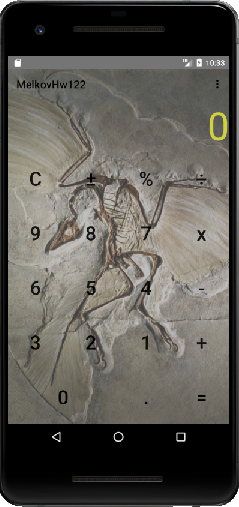

## Задача №2
### Выбор картинки для элемента из внешнего файла
#### Задание:

Дизайн мобильного приложения и возможность его кастомизации — приятная функция для любого пользователя мобильного приложения.

Создайте экран кастомизации калькулятора со следующими элементами:
- EditText для указания ссылки внешний файл (картинку) на устройстве.
- Кнопка ОК - по клику на нее, фон приложения меняется на картинку, лежащую по указанному выше пути. Если картинки по указанному пути нет, нужно выдать Toast об ошибке.

#### Выполнение
- В приложении калькулятор (разработан на предыдущих занятиях) добавить экран (Activity) с настройками.
- Скачать на смартфон картинку для фона (по умолчанию папка Загрузки/Downloads).
- На основном экране добавить кнопку Настройки, которая будет открывать экран настройки приложения.
- На экране настроек добавить EditText для ввода названия картинки.
- На экране настроек добавить Кнопку ОК и обработчик для неё. В обработчике реализовать обращение к внешнему публичному файловому хранилищу (рассматривалось на лекции), найти файл по названию, введённому в тектовое поле, в папке Загрузки (используйте соответствующий параметр функции).
- Если файл не найден, выдать Toast с ошибкой.
- Если файл найден, установить его в качестве фона калькулятора, для этого нужно выполнить следующие шаги:
    - Для добавления инженерного вида калькулятора использовался FrameLayout, сейчас он нам понадобится опять.
    - Нужно сделать "подложку" калькулятору, для этого реализовать структуру фреймов следующего вида:
```
<FrameLayout ...>
    <View [на котором происходит отрисовка] ... />
    <LinearLayout ...> Содержимое страницы (кнопки и прочее) </LinearLayout>
</FrameLayout>
```
- В качестве View "подложки" использовать ImageView. Фреймы будут отображаться "друг на друге" и через прозрачный фон фрейма с калькулятором (стандартный или инженерный вид) будет видно картинку с фоном.
- В коде кнопки ОК экрана настройки указать загрузку картинки в ImageView и закрытие текущего экрана, чтобы при успешной смене картинки фона, пользоватль попадал на калькулятор и видел на фоне загруженную картинку.

